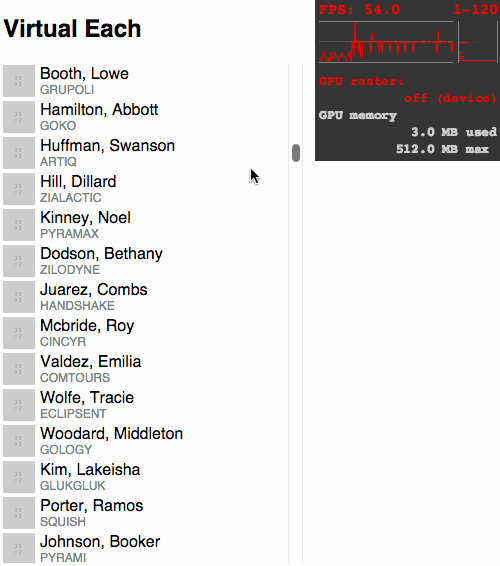

# virtual-each

[](https://travis-ci.org/jason/virtual-each)
[](https://david-dm.org/jasonmit/virtual-each)
[](https://david-dm.org/jasonmit/virtual-each#info=devDependencies)

A direct port of react-infinite-list to Ember.  This was created as a benchmark exercise.

This component will only ever render DOM nodes for what can fill the view port.  Using the power of Glimmer, it will reuse the DOM nodes it's already created and swap out the content as the user scrolls.

If you want a more flexible virtualization component, please try [ember-collection](https://github.com/emberjs/ember-collection).

## Usage

```hbs
{{#virtual-each
  height=200 // required: total height
  itemHeight=36 // required: row height
  onBotttom=(action 'handlePageBottom') // optional: invoked when the scroller hits the bottom
  positionIndex=0 // optional: used to scroll to a specific item index
  items=items as |item actualIndex virtualIndex|
}}
  <div class="person-row">
    
    <div>
      <div>{{actualIndex}}. {{item.name.last}}, {{item.name.first}}</div>
      <div class="company">{{item.company}}</div>
    </div>
  </div>
{{/virtual-each}}
```

## CSS

Add the following CSS snippet to `styles/app.css`:

```css
.virtual-each {
  overflow-y: auto;
}

.infinite-list-content {
  list-style: none;
  margin: 0;
  padding: 0;
}
```

## Demo



## Requirements

* Ember >= 1.13.0

## Installation

* `git clone` this repository
* `npm install`
* `bower install`

## Running

* `ember server`
* Visit your app at http://localhost:4200.

## Running Tests

* `ember test`
* `ember test --server`

## Building

* `ember build`
